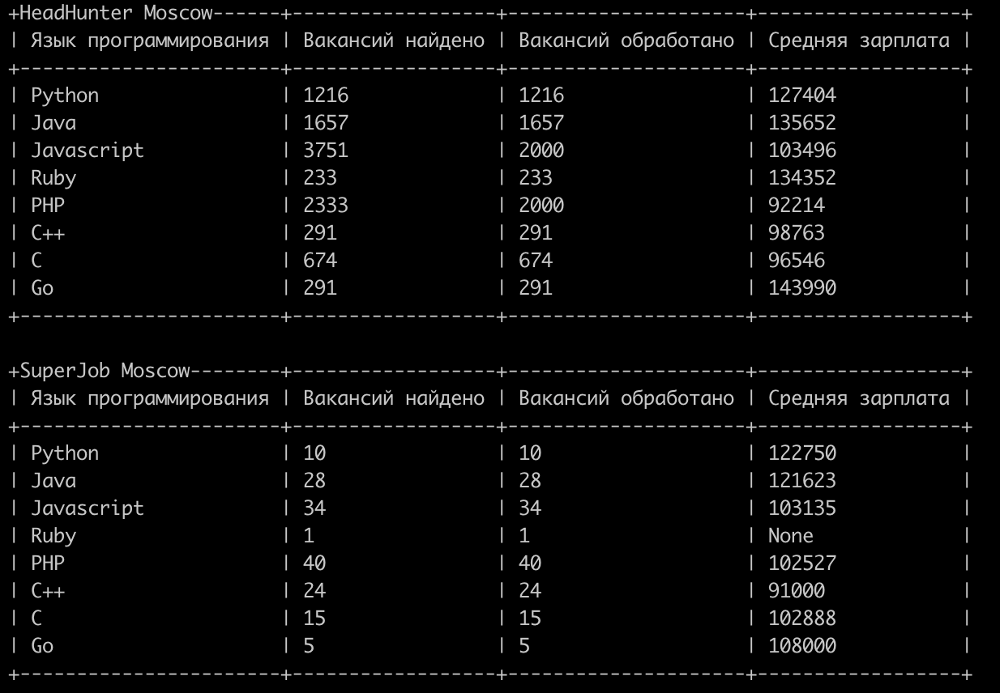

# Сравниваем вакансии программистов
Получение средних зарплат по вакансиям программистов Москвы для разных языков программирования.

### Как установить
Для запуска проекта необходим python3.<br>
Установка зависимостей:
```bash
pip install -r requirements.txt
```
Для работы с API SuperJob необходимо получить токен (https://api.superjob.ru/) и записать его в файл ```.env``` в переменную SJ_TOKEN.<br>
Запуск скрипта:
```bash
python3 vacancies.py
```

### Цель проекта

Код написан в образовательных целях на онлайн-курсе для веб-разработчиков [dvmn.org](https://dvmn.org/).
